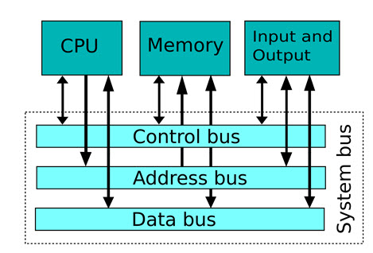

# DDRx基础知识
[内存](https://en.wikipedia.org/wiki/Random-access_memory)是计算机或嵌入式系统中最重要的组成部分之一，是伴随着信息革命诞生的伟大发明。早在20世纪30年代，著名的美国科学家[冯-诺依曼](https://en.wikipedia.org/wiki/John_von_Neumann)提出了计算机的五大基本要素，包括：运算器、控制器、存储器、输入和输出设备，奠定了当代计算机的体系架构，而存储器（包括内存和外部存储）就是其中的一个重要的基本要素。

