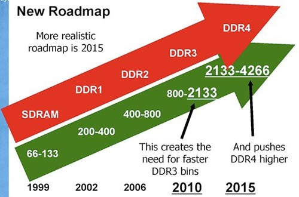

# DDRx技术概览
[内存](https://en.wikipedia.org/wiki/Random-access_memory)是计算机或嵌入式系统中最重要的组成部分之一，是伴随着信息革命诞生的伟大发明。早在20世纪30年代，著名的美国科学家[冯-诺依曼](https://en.wikipedia.org/wiki/John_von_Neumann)提出了计算机的五大基本要素，包括：运算器、控制器、存储器、输入和输出设备，奠定了当代计算机的体系架构，而存储器（包括内存和外部存储）就是其中的一个重要的基本要素。

[内存](https://en.wikipedia.org/wiki/Random-access_memory)有很多种分类，也正经历着不断升级换代的技术演进，目前最广泛成熟应用的DDRx SDRAM，所以文档主要围绕DDRx SDRAM进行。

本章将依次简明扼要介绍从SDRAM到DDR4 SDRAM的相关技术特点，以及关键技术指标，了解技术逐步演变的过程对我们理解DDRx应用中的相关的设计规范有很大的帮助。
