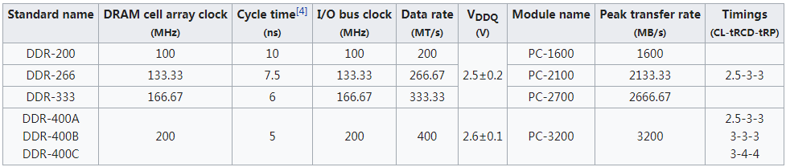

DDR SDRAM
========
为了提高内存的数据传输速率，人们想到可以在一个clock时钟周期的上升沿和下降沿进行数据的传输，[DDR SDRAM](https://en.wikipedia.org/wiki/DDR_SDRAM)应运而生，DDR是Double Data Rate的缩写，因为在同样的时钟频率下，数据传输速率DDR SDRAM是SDR SDRAM的2倍，DDR的名字由此得来。

下面表格列出了DDR SDRAM的芯片和模组的性能参数, 表格来自维基百科。

这里详细说明一下Data rate和Peak transfer rate，从表中我们可以看出DDR的标准命名规则，比如DDR-200，那么200通常代表的是Data rate而不是clock时钟频率。对于DDR来说，由于在上升沿和下降沿均进行数据的传输，所以Data rate是clock的2倍。那么Data rate的单位MT/s又是个什么概念呢？这T代表的是Times次数的意思，比如DDR-200的Data rate是200MT/s，其含义就是每秒200兆次数据的传输，也就是说Data rates反映的是单位时间内的数据传输次数。说到这里，我们自然会想到一个问题，Data rates是单位时间传输次数，那单位时间传输的数据量呢？这个就是Peak transfer rate了，从它的单位MB/s也可以看出来，但是这个值是怎么计算出来的呢？

这个问题要联系到数据的传输位数，比如我们一次传输的数据位宽为32bit，那么对于DDR-200的芯片来说，它的Peak transfer rate计算如下：

Peak transfer rate = 100MHz (Clock frequency) * 2(Double data rate) * 32bit(Data width)/8 = 800MB/s

所以我们这里就彻底搞清楚了几个问题：

* DDR-200中200所代表的含义是什么？
* DDR-200的时钟频率是多少？
* Data rate单位MT/s的含义是什么？
* Peak transfer rate即最大数据传输速率是如何计算的？

