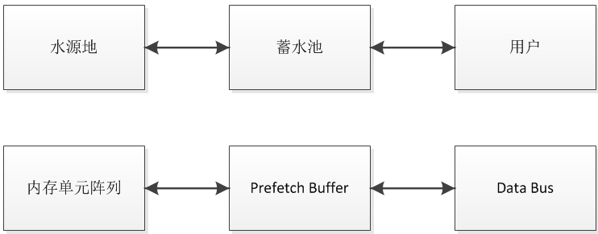
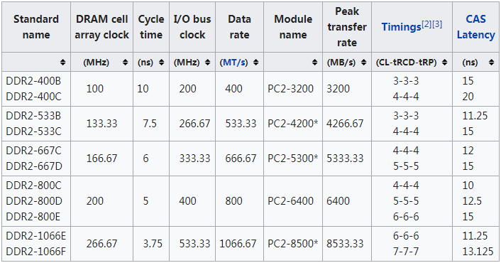

DDR2 SDRAM
=======
DDR2 SDRAM是DDR SDRAM的升级替代版本，DDR2允许更高的时钟和数据速率，并且拥有更低的功耗。DDR2相对DDR多出了一个内部时钟internal clock，这个内部时钟是外部时钟external clock的频率的二分之一。此外它的prefetch length也由DDR的2 bits增加到了4 bits，从而提高了数据传输速率。prefetch的概念，我们可以理解为一个就近的蓄水池，避免了每次取水都要去水源地，从而节省时间。

此外，从DDR2开始，有了[on-die termination](https://en.wikipedia.org/wiki/On-die_termination)的设计，芯片封装也由DDR时代的TSSOP变为BGA，从而大大改善了高频率下的信号完整性问题。为了降低功耗，工作电压由DDR的2.5V降低为1.8V。

下面表格列出了DDR2的芯片和模组的性能参数，表格来自维基百科。

