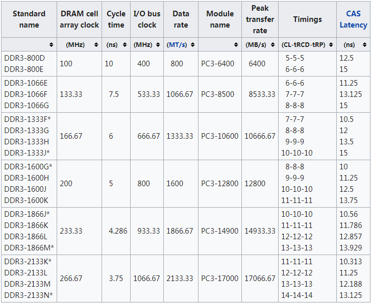

DDR3 SDRAM
====
DDR3 SDRAM是DDR2 SDRAM的升级替换版本，从2007年开始广为使用至今。与上一代DDR2相比，主要feature如下：

* 工作电压1.25V(DDR3U),1.35V(DDR3L),1.5V(DDR3)
* Prefetch buffer size is 8n (eight datawords per memory access)
* 新增Reset引脚
* 新增ZQ校准引脚
* 参考电压VREF分为VREFCA和VREFDQ

DDR3芯片和模组的主要性能参数如下表，数据来源于维基百科。

