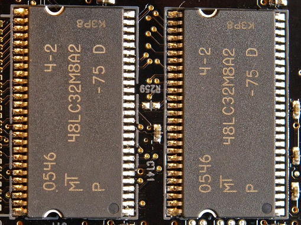

SDRAM
========
[SDRAM](https://en.wikipedia.org/wiki/Synchronous_dynamic_random-access_memory)最早在1970s被应用在Intel的芯片系统，但是直到1993年以后，[JEDEC](https://en.wikipedia.org/wiki/JEDEC)公布了第一个SDRAM的行业标准之后，SDRAM才开始广泛的为电子工业所认可和应用。这个行业标准的推出的意义是深远的，它解决了不同厂商SDRAM芯片的相互兼容性问题，它的成功也促进了后面DDRx SDRAM的标准的陆续公布。让我们回顾一下当时的芯片（如下图，取自维基百科），当代电子设备中已经看不到了，但是我们现在还是可以在Google上搜索到datasheet。

最初的内存包括DRAM通常都是异步的工作模式，什么是异步的工作模式呢？异步和同步都是相对与内存控制器（主芯片）而言的，需要注意的是这里的异步和同步有区别与软件中的概念。在一个异步的工作模式中，对内存的操作完全依赖于控制输入信号，这样的缺点很直观，你来一个控制信号，我就响应一下，操作模式太简单直接，操作效率比较低。而引入同步的工作模式后，内存可以同步内存控制器或者说主芯片的时钟，换而言之，内存的操作有了参考时钟，就好比我们从远古时代混沌度日进化到了拥有时间的概念，这样，内存芯片内部有一个状态机，内存的操作响应需要等待时钟信号的调度和指挥而不是像DRAM时代立即直接响应内存操作。这就是timing的由来，timing的出现提供了内存操作复杂多样化的可能性而不用像DRAM那样one-by-one，从而提高了内存的操作效率。
