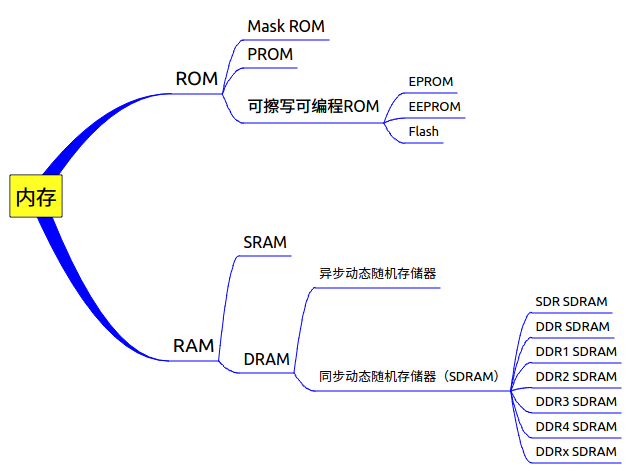

内存的类型
==========
内存是一个笼统的说法，通常按工作原理可以分为两大类，[ROM](https://en.wikipedia.org/wiki/Read-only_memory)（read only memory）和[RAM](https://en.wikipedia.org/wiki/Random-access_memory)（random access memory）。ROM可分为三大类，[Mask ROM](https://en.wikipedia.org/wiki/Mask_ROM)（掩模式只读存储器）、[PROM](https://en.wikipedia.org/wiki/Programmable_read-only_memory)（Programmable ROM，可编程ROM）、可擦写可编程ROM（包括[EPROM](https://en.wikipedia.org/wiki/EPROM)、[EEPROM](https://en.wikipedia.org/wiki/EEPROM)和[FLASH](https://en.wikipedia.org/wiki/Flash_memory)）。RAM可以分为两大类，[SRAM](https://en.wikipedia.org/wiki/Static_random-access_memory)（Static RAM，静态随机存储器）和[DRAM](https://en.wikipedia.org/wiki/Dynamic_random-access_memory)（Dynamic RAM，动态随机存储器），DRAM又分为[SDRAM](https://en.wikipedia.org/wiki/Synchronous_dynamic_random-access_memory)（synchronous DRAM，同步动态随机存储器）和异步动态随机存储器，SDRAM是目前应用最广泛的类型，DDRx系列都归类为SDRAM。这里简单介绍下同步，通常DRAM是有一个异步接口的，这样可以随时响应控制输入的变化，而SDRAM有一个同步接口，在响应控制输入前会等待一个时钟信号，这样就能和计算机的系统总线同步。可以这样简单的理解，SDRAM即是加了同步接口的DRAM。

