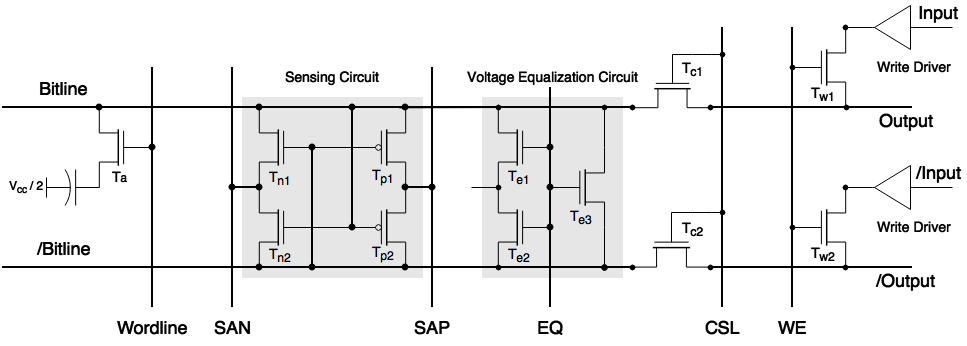
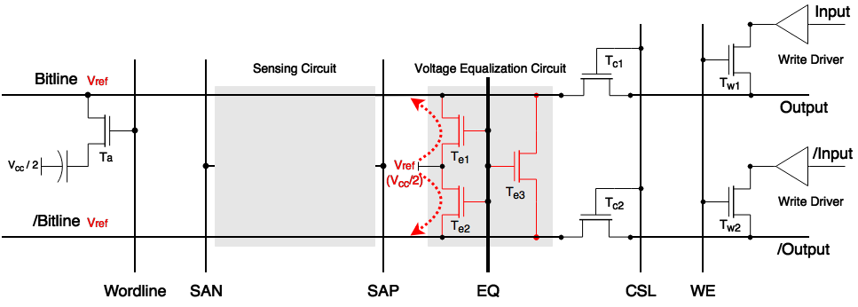
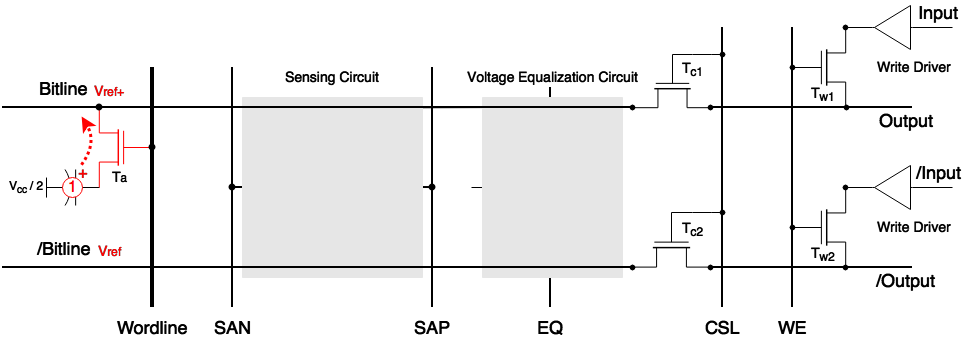
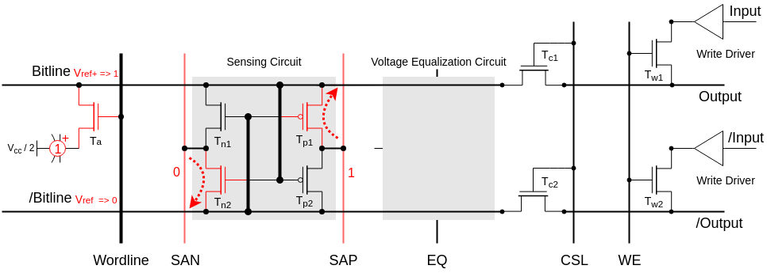

>DDR的数据存在哪里？DDR为什么需要自刷新？DDRL3-1600(11-11-11)这些数字都代表什么意思？带着这些问题，让我们深入理解一下Storage Cell。

Storage CELL
========

首先我们先来看一下DDR的Storage Cell，DDR是通过下图中的Storage Capacitor来存储数据信息的。

整个DDR的Storage Cell由以下 4 个部分组成：

1. 存储电容（Storage Capacitor），它通过存储在电容两端电压差的高和低，来表示逻辑上的1和0。
2. 访问晶体管（Access Transistor），它的导通和截止，决定了允许或禁止对Storage Capacitor所存储的信息的读取和改写。
3. 字线（Wordline），它决定了Access Transistor的导通或者截止。
4. 位线（Bitline），它是外界访问Storage Capacitor的唯一通道，当Access Transistor导通后，外界可以通过Bitline对Storage Capacitor进行读取或者写入操作。

Storage Capacitor的负极接在Vcc/2。
当Storage Capacitor存储的信息为1时，另一端电压为Vcc，此时其所存储的电荷

$$Q = +Vcc/2 / C$$

当Storage Capacitor存储的信息为0时，另一端电压为0，此时其所存储的电荷

$$Q = -Vcc/2 / C$$

Cell读写原理
-------------
 从上面的结构图上分析，我们可以很容易的推测出Storage Cell的数据读写流程：

* 读数据时，Wordline设为逻辑高电平，打开Access Transistor，然后在Bitline上读取Storage Cell的状态
* 写数据时，先把要写入的电平状态设定到Bitline上，然后打开Access Transistor，通过Bitline改变Storage Capacitor存储的电荷状态。

然而，在具体实现上，如果按照上面的流程对 DRAM Storage Cell 进行读写，会遇到以下的问题：

1.	外界的逻辑电平与Storage Capacitor的电平不匹配。
由于Bitline的电容值比Storage Capacitor要大的多（通常为 10 倍以上），当Access Transistor导通后，如果Storage Capacitor存储的信息为1时，Bitline电压变化非常小。外界电路无法直接通过Bitline来读取Storage Capacitor所存储的信息。
2.	进行一次读取操作后，Storage Capacitor存储的电荷会变化
在进行一次读取操作的过程中，Access Transistor导通后，由于 Bitline和Storage Capacitor端的电压不一致，会导致Storage Capacitor中存储的电荷量被改变。最终可能会导致在下一次读取操作过程中，无法正确的判断Storage Capacitor内存储的信息。
3.	由于Capacitor的物理特性，即使不进行读写操作，其所存储的电荷都会慢慢变少，这个特性要求 DRAM 在没有读写操作时，也要主动对 Storage Capacitor进行电荷恢复的操作。

为解决上述的问题，DRAM 在设计上，引入了差分感应放大器（Differential Sense Amplifier）。

差分感应放大器
--------
差分感应放大器包含Sensing Circuit和Voltage Equalization Circuit两个主要部分。它主要的功能就是将存储电容中存储的信息转换为逻辑1或者0所对应的电压，并且呈现到Bitline上。同时，在完成一次读取操作后，通过Bitline将Storage Capacitor中的电荷恢复到读取之前的状态。

下文将针对差分感应放大器的作用做详细的说明

###读操作

完整的读操作包含了四个阶段，分别是Precharge、Access、Sense、Restore。下文中将通过一个Bit 1数据读取的过程介绍以上四个阶段中的操作。

####预充电(Prechange)

在这个阶段，主要是针对Bitline上进行预充电，通过控制EQ信号，让Te1、Te2、Te3这三个晶体管处于导通状态，这样将Bitline和/Bitline线上的电压稳定在Vref上, $Vref = Vcc/2$。然后进入到下一个阶段。

####获取(Access)

经过Precharge阶段，Bitline和/Bitline线上的电压已经稳定在Vref上了，此时，通过控制Wordline信号，将Ta晶体管导通。Storage Capacitor中存储正电荷会流向Bitline，继而将Bitline的电压拉升到 Vref+，然后进入到下一个阶段。

####感应(Sense)
由于在Access阶段，Bitline的电压被拉升到Vref+，Tn2会比Tn1更具导通性，Tp1则会比Tp2更具导通性。
此时，SAN(Sense-Amplifier N-Fet Control)会被设定为逻辑0的电压，SAP(Sense-Amplifier P-Fet Control)则会被设定为逻辑1的电压，即Vcc。由于Tn2会比Tn1更具导通性，/Bitline上的电压会更快被SAN拉到逻辑0电压，同理，Bitline上的电压也会更快被SAP拉到逻辑1电压。接着Tp1和Tn2进入导通状态，Tp2和Tn1进入截止状态。最后，Bitline和/Bitline的电压都进入稳定状态，正确的呈现了Storage Capacitor所存储的Bit信息。

####恢复(Restore)
在完成Sense阶段的操作后，Bitline线处于稳定的逻辑1电压Vcc，此时Bitline会对Storage Capacitor进行充电。经过特定的时间后，Storage Capacitor的电荷就可以恢复到读取操作前的状态。
最后，通过CSL信号，让Tc1和Tc2进入导通状态，外界就可以从Bitline上读取到具体的信息。

